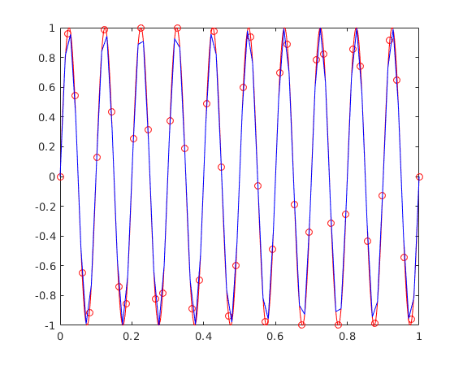

# Radial Basis Functions Interpolation

This is a set of Matlab functions to interpolate scattered data with Radial Basis Functions (RBF),

<p align="center">
  
</p>


## Getting Started

```Matlab
y = RBFinterp(xs, ys, x, RBFtype, R)
```
interpolates to find y, the values of the function y=f(x) at the points x.

Xs must be a matrix of size [N,Dx], with N the number of data points and Dx the dimension of the points in xs and x.

Ys must be a matrix of size [N,Dy], with N the number of known values at points in Xs, and Dy the dimension of the y values.

X must be a matrix of size [M,Dx], with M the number of query points.

RBFtype specifies the radial basis functions (RBF) to be used. 

* The available global support RBFs are:
	* 'R1'    - linear spline
	* 'R3'    - cubic spline
	* 'TPS2'  - thin plate spline
	* 'Q'     - quadric
	* 'MQ'    - multiquadric
	* 'IMQ'   - inverse multiquadric
	* 'IQ'    - inverse quadric
	* 'GS'    - Gauss
	
| RBF name | Abbreviation |  |
| :---: | :---: | :---: |
| Linear spline | R1 |  |
| Cubic splie | R3 |  |
| Thin plate spline | TPS2|  |
| Quadric | Q |  |
| Multiquadric | MQ |  |
| Inverse multiquadric | IMQ |  |
| Inverse quadric | IQ |  |
| Gauss | GS |  |

* The available compact support RBFs are (see Wendland H., Konstruktion und Untersuchung radialer Basisfunktionen mit kompaktem Träger. PhD  thesis, Göttingen, Georg-August-Universität zu Göttingen, Diss, 1996):
	* 'CP_C0'
	* 'CP_C2'
	* 'CP_C4'
	* 'CP_C6'
	* 'CTPS_C0'
	* 'CTPS_C1'
	* 'CTPS_C2a'
	* 'CTPS_C2b'

Compact support functions have the form

<p align="center">
	
</p>

| RBF name |  |
| :---: | :---: |
|  |  |
|  |  |
| |  |
|  |  |
|  |  |
|  |  |
|  |  |
|  |  |

R is either the support radius for the compact support RBFs or a parameter to make the distance values dimensionless for the global support RBFs.

```Matlab
[fPar, M] = RBFparam(xs, ys, RBFtype, R)
```

returns the weights in the RBF summation and the polynomial coefficients in a column vector fPar by solving a linear system

<p align="center">
    
</p>

```Matlab
[y] = RBFeval(xs, x, fPar, RBFtype, R)
```

returns the values of the interpolation weighted function at points x by performing the matrix-vector product

<p align="center">
    
</p>

## Running the example

An example case can be run just by typing in the Matlab command line

```Matlab
test
```


<p align="center">
  
</p>

## References

* Beckert, Armin and Wendland, Holger. Multivariate interpolation for fluid-structure-interaction problems using radial basis functions. _Aerospace Science and Technology_, 5 (2), p. 125-134, 2001.
* Wendland, Holger. _Konstruktion und Untersuchung radialer Basisfunktionen mit kompaktem Träger}_. PhD thesis, Göttingen, Georg-August-Universität zu Göttingen, Diss, 1996.
* De Boer, A and Van der Schoot, MS and Bijl, Hester. Mesh deformation based on radial basis function interpolation. _Computers & structures_, 85 (11-14), p. 784-795, 2007.
* Biancolini, Marco Evangelos. _Fast Radial Basis Functions for Engineering Applications_. Springer, 2018.
